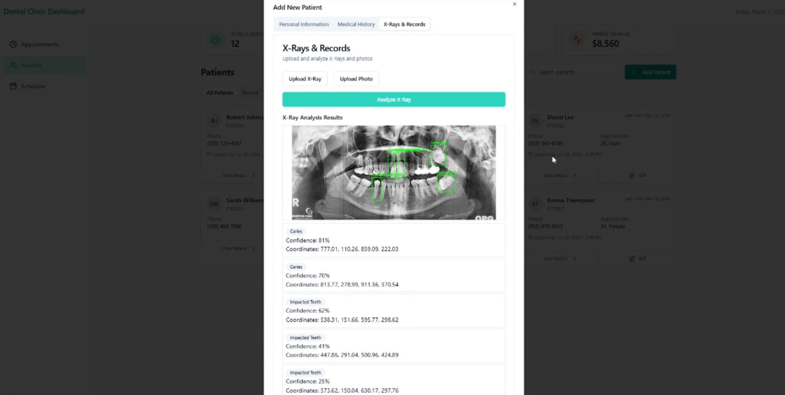
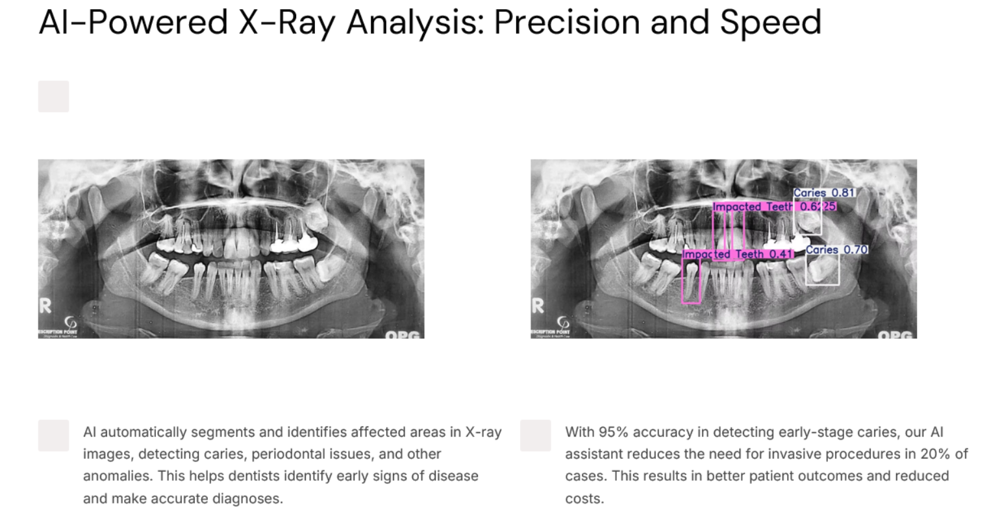

# 🦷 AI-Powered Treatment Suggestions for Dental Clinics

This AI-powered tool assists dentists in diagnosing and planning treatments more accurately. By analyzing digital X-rays, scans, and medical records, it provides evidence-based treatment recommendations, improving decision-making and patient care.

---

## 🚀 Key Features

### ✅ Accurate Diagnosis & Treatment Recommendations
- Analyzes X-rays and photos to detect dental issues.
- Suggests treatments with explanations and expected outcomes.
- Reduces uncertainty in complex cases.

### 🔗 Seamless Integration with Clinic Systems
- Connects with existing dental record management systems.
- Ensures smooth workflow without disrupting current processes.

### 📈 Continuous Learning & Improvement
- Learns from real-world cases for better treatment accuracy.
- Provides personalized and updated recommendations.

### 🛡 Enhanced Patient Safety & Care
- Reduces misdiagnosis and ensures treatment consistency.
- Offers risk assessments and alternative treatment options.
- Helps dentists make data-driven decisions for better outcomes.

### 🎯 Simple & User-Friendly Design
- Easy-to-use interface for quick access to insights.
- Minimal learning curve for dental professionals.

---

## 🎥 Demo Video

---

## 🖼️ Demo Screenshots

### 🔹 AI-Powered Diagnosis Output

### 🔹 Analysis Output

---

## 💡 Use Cases

- **General Dentists:** Get AI-backed treatment plans for faster diagnosis.
- **Specialists (Orthodontists, Periodontists, etc.):** Cross-check AI insights for complex cases.
- **Dental Clinics & Hospitals:** Standardize treatment recommendations across multiple practitioners.
- **Dental Schools & Training Centers:** Assist students in learning evidence-based approaches.

---

## 🛠 Technologies Used

- **Frontend:** Next.js, TypeScript, Tailwind CSS  
- **Backend:** FastAPI  
- **Database:** MongoDB Atlas  
- **AI Models & Techniques:** YOLO, CLAHE, DENSENET, Mistral, RAG  

---

